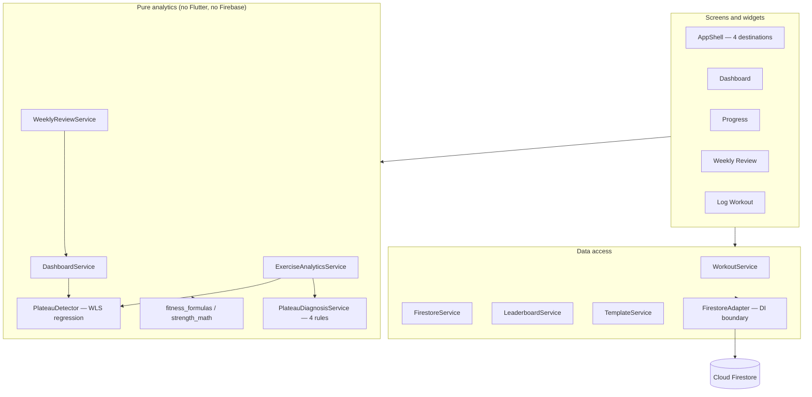

# GymConnect Coach

A Flutter/Firebase strength-training tracker that does something mainstream
gym apps don't: when your progress on a lift stalls, it tells you **that**
it stalled, **why it thinks so**, and **what evidence** that conclusion
rests on.

Built as a final-year BSc Computer Science dissertation at Bournemouth
University, then rebuilt over a structured 12-phase upgrade into a
portfolio-quality analytics application.

---

## Why this project is interesting

Most trackers are data-entry apps with a chart bolted on. This one is built
around a small analytics engine with rules that can be stated, tested and
argued with:

- **Plateau detection** — weighted least-squares regression over estimated
  1RM per session, with exponential recency decay (λ = 0.85) and a
  *relative* flat-band (±0.25 % per session of the weighted mean), so the
  same threshold works for a 40 kg lift and a 200 kg one.
- **Root-cause diagnosis** — four ranked rules (frequency drop, rep
  monotony, continuous escalation, no recovery week) offer a *possible*
  explanation for a stall, drawn from the user's own logged data.
- **Volume-progression suppression** — a flat 1RM while total volume is
  rising is not reported as a plateau, because it usually isn't one.
- **Explainability as a first-class feature** — every metric carries typed
  evidence, and every screen can show the facts behind its claim. Where
  data is insufficient the app says so; it never invents a confidence
  percentage or a trend it cannot support.
- **Nothing pretends to be medical advice.** Diagnoses are phrased as
  possibilities, never proven causes.

The analytics layer is pure Dart with injected reference dates — no
Firestore, no Flutter, no wall-clock reads — which is why it can be tested
exhaustively.

---

## Screenshots

Not yet captured in the repository. The release checklist
(docs/RELEASE_CHECKLIST.md) covers the device pass that produces them;
they belong in `docs/screenshots/` and should come from a demo-seeded
account (see [Demo data](#demo-data-development)), never from real user
data.

---

## Features

**Logging** — multiple exercises and sets, exercise autocomplete and recent
chips, warm-up flag (max one per exercise, excluded from analytics),
optional session name, 1–5 star session "feel" rating, repeat-last-workout,
templates prefilled from your last actual performance, progressive-overload
hints, post-save volume summary.

**Dashboard** — weekly activity and volume with week-over-week change, a
typed training status, most-trained exercises, recent personal records, goal
progress, and session-feel insights.

**Progress** — per-exercise analytics: strength trend with status, recent
best, frequency, strength/volume change vs the previous four weeks, an
estimated-1RM chart, an expandable evidence panel, a possible explanation
when a stall is detected, and full session history with per-set deletion
(which recalculates the affected personal record).

**Weekly Review** — a deterministic Monday–Sunday coaching review:
improvements, steady areas, things to watch, and cautious evidence-backed
suggested actions. Prose comes from a narrator behind an interface, so the
analytics and the wording stay separable.

**Gym leaderboard** — best lifts ranked per exercise among users sharing a
gym ID, with an anonymity toggle that stores a safe display value rather
than relying on the client to hide a real name.

**Throughout** — kg/lbs toggle applied at the display boundary (storage is
always kg), light/dark themes, typed failure states with retry, and
last-known-data-behind-a-banner on refresh failures.

---

## Architecture



Key decisions, all recorded in `docs/DECISIONS.md`:

- **Every Firestore call goes through `FirestoreAdapter`**, so services are
  tested against a handwritten in-memory fake — no mocking package.
- **Analytics services are pure and take a `referenceDate`**, so no test
  depends on the wall clock.
- **Typed results, not prose strings** — `MetricResult` is either available
  or unavailable *with a reason*; data quality is a category, never an
  invented percentage.
- **No state-management, routing or DI package.** Plain `StatefulWidget`
  plus a few global `ValueNotifier`s (theme, unit, a data-version signal
  that tells live tabs to reload). Screens take optional injected
  services/loaders for testability; production call sites pass nothing.
- **All weights stored in kg**, converted once at the display boundary.

Fuller detail: `docs/ARCHITECTURE.md` (layering, data model, invariants)
and `docs/ANALYTICS_DEFINITIONS.md` (every metric's exact definition).

---

## Getting started

**Requirements:** Flutter 3.41.5 (Dart SDK ^3.11.3), an Android device or
emulator, and your own Firebase project.

```bash
git clone <this repo>
cd GymConnect
flutter pub get
```

Firebase configuration is **not committed** (it contains an API key). Supply
your own:

1. Create a Firebase project with **Authentication → Email/Password** enabled
   and **Cloud Firestore** provisioned.
2. Run `flutterfire configure`, which writes `lib/firebase_options.dart` and
   `android/app/google-services.json`. Both are gitignored by design.
3. Deploy the security rules from `firestore.rules` — manually, following
   `docs/FIRESTORE_SECURITY.md`. Nothing in this repository deploys them for
   you.

```bash
flutter run
```

---

## Tests

```bash
flutter test
```

Covers the analytics services (plateau detection and diagnosis, feel
analysis, dashboard, exercise detail, weekly review), formulas and units,
the data layer against an in-memory fake, the demo and migration tooling,
and widget tests for every main screen including the full workout-logging
form. `docs/TEST_PLAN.md` tracks exact counts per phase.

Firestore security rules have their own emulator suite (Node 18+,
`firebase-tools`, and a JDK 21+ — Android Studio's bundled JBR works;
details in `docs/FIRESTORE_SECURITY.md`):

```bash
npm --prefix test_rules install   # once
npm --prefix test_rules test
```

`analyze` is held at **zero issues** as a standing baseline.

---

## Continuous integration

`.github/workflows/ci.yml` runs on every push and pull request to `main`:
format check, `flutter analyze`, the full Flutter suite, and the Firestore
rules suite on the emulator.

CI holds no secrets and deploys nothing. It writes a keyless placeholder
Firebase config (`tool/ci/firebase_options_stub.dart`) so a fresh checkout
compiles, and the rules job runs against an offline `demo-` project id so it
cannot reach a live project.

---

## Demo data (development)

Deterministic demo scenarios — progressing, plateau, regression,
volume-progressing, insufficient data — can be seeded into an account for
demos and screenshots. Seeded workouts are tagged `isDemo: true` and are
fully removable; normal workouts are never touched.

- In a **debug build**: More → Developer → Demo Data (absent from release
  builds).
- From the **CLI**:

  ```bash
  set GYMCONNECT_FIREBASE_API_KEY=<web api key>
  set GYMCONNECT_FIREBASE_PROJECT_ID=<project id>
  dart run tool/seed_data.dart list-scenarios
  dart run tool/seed_data.dart seed --scenario progressing
  dart run tool/seed_data.dart cleanup --all --dry-run
  ```

No keys are committed; configuration comes from the environment.

---

## Migrating legacy stored values

Records written before the formula fix (uncapped estimates, warm-ups
counted) and leaderboard entries written before the anonymity fix can be
corrected with an opt-in, idempotent tool that is **read-only unless you
pass `--apply`** and never deletes anything:

```bash
dart run tool/migrate_data.dart inspect          # report only
dart run tool/migrate_data.dart fix-all          # dry run
dart run tool/migrate_data.dart fix-all --apply  # writes, after confirmation
```

Full safety model and procedure: `docs/MIGRATION.md`.

---

## Known limitations

- **Single-device freshness.** Data changed on another device appears after
  pull-to-refresh or restart; there are no realtime listeners, by design.
- **Unbounded reads.** Workout and leaderboard collections are read without
  pagination — fine at the scale this app targets, documented as a scaling
  limit.
- **Leaderboard trust model.** Values are self-reported with no
  verification; the feature is motivational, not competitive.
- **Estimated 1RM is an estimate.** Capped Epley, not a measured maximum.
- **Migration is per-account.** Correcting another user's stored values
  would need privileged Admin SDK credentials, which this project
  deliberately does not use.
- **No end-to-end tests.** Coverage is unit plus widget; full integration
  testing is not in scope.
- **Android-focused.** iOS/web are unconfigured.

---

## Project documentation

| Document | Contents |
|---|---|
| `docs/PRODUCT_SPEC.md` | Features, user-visible behaviour |
| `docs/ARCHITECTURE.md` | Layering, data model, invariants |
| `docs/ANALYTICS_DEFINITIONS.md` | Exact definition of every metric |
| `docs/DECISIONS.md` | Decision log with rationale and consequences |
| `docs/TEST_PLAN.md` | Test strategy and per-phase counts |
| `docs/BACKLOG.md` | Phase plan and known-issues register |
| `docs/FIRESTORE_SECURITY.md` | Rules model and manual deployment procedure |
| `docs/MIGRATION.md` | Stored-value migration tool |
| `docs/RELEASE_CHECKLIST.md` | Pre-release verification procedure |

---

## Academic context and AI assistance

The original dissertation build was submitted for a BSc Computer Science
final-year project at Bournemouth University. Its academic contribution is
the plateau-detection and rule-based diagnosis approach.

The subsequent **GymConnect Coach** upgrade (the 12-phase rework recorded in
`docs/BACKLOG.md` and `docs/DECISIONS.md`) was carried out **after
submission** as a portfolio exercise, working with Claude Code as an AI
pair-programmer under a phase-by-phase workflow: each phase was specified
and approved before implementation, and ended with formatting, analysis, the
full test suite, an explicit report and a review checkpoint. Every
architectural decision is recorded with its rationale in the decision log.

The dissertation submission itself is a separate, earlier artefact; this
disclosure applies to the post-submission upgrade in this repository.
